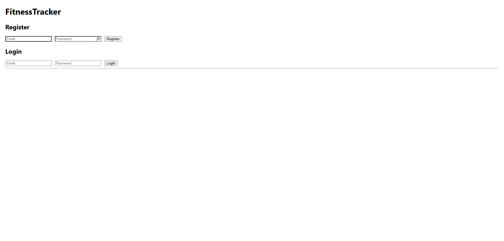
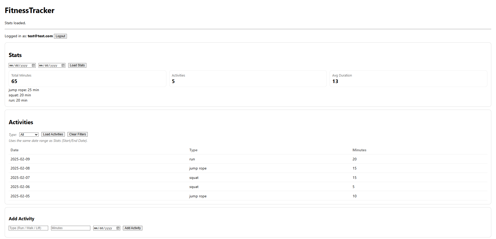

# FitnessTracker

A small full-stack fitness tracker built to practice and demonstrate core ASP.NET Core Web API concepts.
Users can register and log in, create fitness activities, filter activity history, and view basic aggregate statistics.

The backend is implemented with ASP.NET Core, Entity Framework Core, and SQLite.
The frontend is a lightweight HTML, CSS, and JavaScript application served directly from the API.

## Features

- User authentication (register + login) using JWT
- Activity CRUD
  - Create activity
  - View all activities
  - View activity by ID
  - Update activities
  - Delete activities
- Filters
  - Filter activity history by activity type
  - Filter by date range
- Stats
  - Total minutes
  - Activity count
  - Average duration
  - Minutes grouped by activity type
- Dynamic activity type dropdown
  - Filter dropdown is populated from the user’s actual data

## Tech Stack

Backend:
- C# / ASP.NET Core Web API
- Entity Framework Core
- SQLite
- JWT authentication
- Swagger / OpenAPI (development)

Frontend:
- HTML + CSS
- Vanilla JavaScript (Fetch API)
- JWT stored in browser LocalStorage

## How to Run

### Prerequisites
- .NET 8 SDK (or the version targeted by the solution)

## Run Locally

1. Clone the repository
2. Open the solution in Visual Studio **or** run from a terminal:

   ```bash
   dotnet restore
   dotnet run
   ```

The application:
- Serves the frontend from `wwwroot`
- Applies EF Core migrations automatically on startup

### URLs
- Frontend: https://localhost:<port>/
- Swagger UI (dev): https://localhost:<port>/swagger

## Frontend Usage

1. Register a new account
2. Log in (JWT is stored in browser LocalStorage)
3. Add fitness activities
4. Use date filters and the activity type dropdown to filter activity history
5. Load statistics for the selected date range

## API Endpoints

### Auth

POST `/auth/register`

Body:
```json
{ "email": "test@test.com", "password": "password123" }
```

POST `/auth/login`

Body:
```json
{ "email": "test@test.com", "password": "password123" }
```

Response:
```json
{ "token": "<jwt>" }
```

### Fitness (JWT required unless noted)

GET `/api/fitness/status` (AllowAnonymous)

GET `/api/fitness/activities?type={type}&from={iso}&to={iso}`

GET `/api/fitness/activities/{id}`

POST `/api/fitness/activities`

Body:
```json
{ "type": "Run", "durationMinutes": 30, "date": "2026-02-07T00:00:00.000Z" }
```

PUT `/api/fitness/activities/{id}`

DELETE `/api/fitness/activities/{id}`

### Stats

GET `/api/fitness/stats?startDate={iso}&endDate={iso}`

Response:
```json
{
  "totalMinutes": 60,
  "activityCount": 2,
  "averageDurationMinutes": 30,
  "minutesByType": { "Run": 30, "Walk": 30 },
  "startDate": "2026-02-01T00:00:00Z",
  "endDate": "2026-02-07T23:59:59.999Z"
}
```

## Activity Types

GET /api/fitness/activity-types

Returns a list of distinct activity types for the logged-in user.  
Used to populate the activity filter dropdown in the UI.

## Project Structure

- `wwwroot/` — Static frontend files (`index.html`, `app.js`, `styles.css`)
- `BackEnd/Controllers/` — API controllers (`AuthController`, `FitnessController`)
- `BackEnd/Services/` — Business logic and data access (`FitnessService`)
- `BackEnd/Data/` — EF Core `DbContext` and design-time factory
- `BackEnd/Models/` — Entity models
- `BackEnd/DTOs/` — Request/response DTOs
- `Migrations/` — EF Core migrations
- `BackEnd/fitness.db` — Local SQLite database


## Notes
JWT is sent via:

Authorization: Bearer <token>

Passwords are stored as a hash + salt (no plaintext storage).

## Next Improvements:
1. Add edit/delete controls in the UI (calls existing PUT/DELETE endpoints)
2. Add logout token invalidation / refresh tokens
3. Add pagination for activities
4. Add richer validation + standardized error responses
5. Add unit tests (service + controller tests)
6. Add Docker support

## Screenshots

### Login / Register


### Dashboard


---

Author: Benjamin Aeschliman
